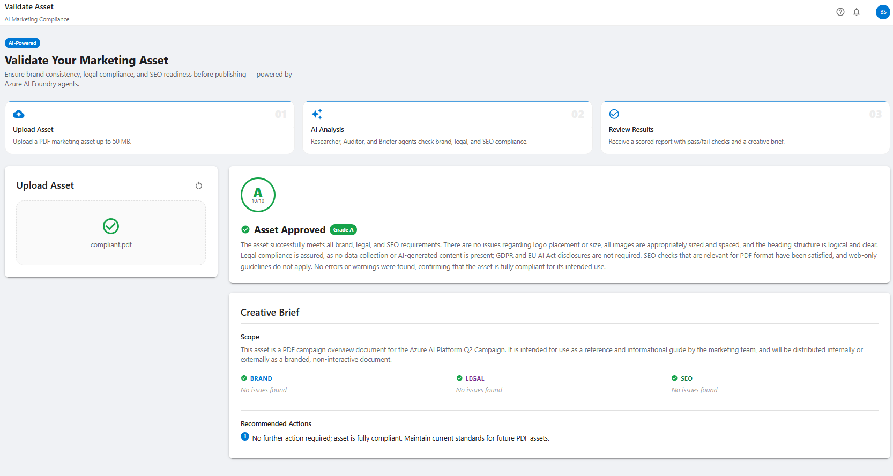
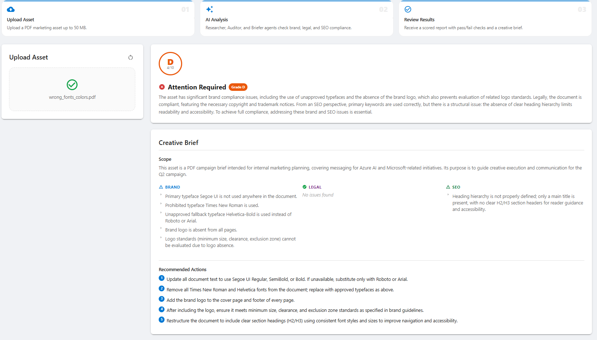
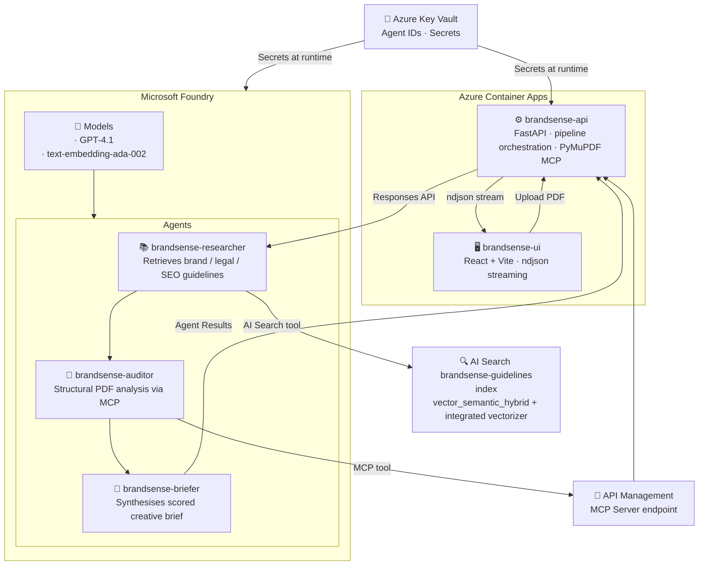
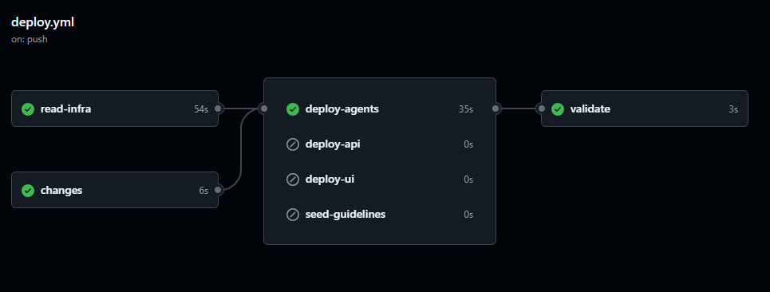

# BrandSense

**AI-Powered Marketing Asset Validation on Microsoft Foundry**

BrandSense ingests PDF marketing assets and runs them through a three-agent pipeline that checks brand compliance, legal requirements, and SEO best practices — then produces a structured, scored creative brief.

> Upload PDF → **Researcher** retrieves guidelines → **Auditor** analyses PDF structure → **Briefer** produces scored brief

---

## Overview

BrandSense demonstrates a production-ready multi-agent pattern on [Microsoft Foundry](https://ai.azure.com/) where three specialised agents collaborate sequentially to validate marketing content against curated brand, legal, and SEO guidelines.

**What you'll learn from this sample:**
- Orchestrating multiple Foundry agents in a sequential pipeline via the Responses API
- Connecting agents to external tools using the Model Context Protocol (MCP) through API Management
- Building an AI Search index with vector + semantic hybrid search and an integrated vectorizer
- Streaming real-time agent progress to a React frontend over ndjson
- Full infrastructure-as-code with Terraform and single-command deployment via PowerShell

| **Compliant** — all checks pass, scored brief generated | **Non-compliant** — font violations flagged, remediation suggested |
|---|---|
|  |  |

---

## Architecture



### Core Components

| Component | Technology | Role |
|---|---|---|
| **brandsense-researcher** | Microsoft Foundry Agent | Retrieves brand, legal, and SEO guidelines from AI Search |
| **brandsense-auditor** | Microsoft Foundry Agent | Analyses PDF structure and content via PyMuPDF MCP tool |
| **brandsense-briefer** | Microsoft Foundry Agent | Synthesises agent outputs into a scored creative brief |
| **brandsense-api** | FastAPI, Python | Pipeline orchestration, PyMuPDF MCP server, PDF handling |
| **brandsense-ui** | React, Vite | Upload interface with real-time streaming progress |
| **AI Search** | Azure AI Search | Guidelines index with vector + semantic hybrid search and integrated vectorizer |
| **API Management** | Azure APIM | Exposes the brandsense-api as an MCP server for the Auditor agent |

---

## Project Structure

<details>
<summary>Expand to view repository layout</summary>

```
Azure-AI-Foundry-BrandSense/
├── deploy.ps1                          # Full end-to-end deployment orchestrator
├── README.md                           # This file
│
├── agents/                             # Foundry agent definitions + deployer
│   ├── deploy.py                       # Creates / updates all three agents, writes IDs to Key Vault
│   ├── researcher.py                   # Researcher agent definition
│   ├── auditor.py                      # Auditor agent definition
│   └── briefer.py                      # Briefer agent definition
│
├── apps/
│   ├── services/
│   │   └── brandsense-api/             # FastAPI backend
│   │       ├── src/
│   │       │   ├── main.py             # FastAPI app, MCP tool endpoints
│   │       │   ├── config.py           # Environment / Key Vault config
│   │       │   ├── models.py           # Pydantic models
│   │       │   ├── tools/              # PyMuPDF MCP tool implementation
│   │       │   └── workflow/
│   │       │       └── pipeline.py     # Three-agent pipeline orchestrator
│   │       └── Dockerfile
│   └── ui/                             # React + Vite frontend
│       ├── src/
│       │   ├── App.jsx
│       │   └── components/             # UploadPanel, ResultsPanel, Sidebar, StatusChip
│       └── Dockerfile
│
├── infra/                              # Infrastructure as Code (Terraform)
│   ├── main.tf                         # Root module — wires all modules together
│   ├── variables.tf
│   ├── terraform.tfvars                # Environment-specific values
│   └── modules/
│       ├── ai_services/                # Microsoft Foundry account + project + model deployments
│       ├── search/                     # AI Search (SKU, semantic search tier, system identity)
│       ├── container_apps/             # brandsense-api and brandsense-ui Container Apps
│       ├── apim/                       # API Management
│       ├── key_vault/                  # Key Vault + secrets
│       ├── container_registry/         # ACR
│       ├── identity/                   # User-assigned managed identity + RBAC
│       ├── monitoring/                 # Log Analytics + Application Insights
│       └── storage/                    # Storage Account for PDF uploads
│
├── scripts/
│   ├── load/
│   │   ├── guidelines.py               # Seeds brandsense-guidelines AI Search index
│   │   └── data/                       # brand.json, legal.json, seo.json
│   ├── Deploy-Infrastructure.ps1       # Phase 1: Terraform apply
│   ├── Deploy-Containers.ps1           # Phase 1.5: ACR image build & push
│   ├── Deploy-FoundryAgents.ps1        # Phase 3: Agent deploy + Key Vault write
│   ├── New-GitHubOidc.ps1             # GitHub Actions OIDC setup
│   └── common/
│       └── DeploymentFunctions.psm1    # Shared PowerShell utilities
│
└── docs/                               # Deployment guide and project documentation
```

</details>

---

## Deployment

### Prerequisites

| Tool | Version | Notes |
|---|---|---|
| Azure CLI | Latest | `az login` authenticated |
| Terraform | ≥ 1.5 | Infrastructure as Code |
| PowerShell | 7+ | Required for deployment scripts |
| Python | 3.11+ | Agent deploy + index seeding |
| GitHub CLI | Latest | Only required for `-SetupGitHub` |

> Docker is **not** required — container images are built remotely in Azure Container Registry via `az acr build`.

### 1. Clone the Repository

```bash
git clone https://github.com/jonathanscholtes/Azure-AI-Foundry-BrandSense.git
cd Azure-AI-Foundry-BrandSense
```

> For the full step-by-step walkthrough (including manual portal steps and teardown), see [docs/deployment_steps.md](docs/deployment_steps.md).

### 2. Deploy Everything (Single Command)

```powershell
az login
az account set --subscription "YOUR-SUBSCRIPTION-NAME-OR-ID"

.\deploy.ps1 -Subscription "YOUR-SUBSCRIPTION-NAME-OR-ID" -SetupGitHub
```

**The deployment runs seven phases automatically:**

| Phase | Script | What it does |
|---|---|---|
| 0 — Bootstrap | *(inline)* | Creates Terraform remote state backend (Storage Account + container) |
| 1 — Infrastructure | `Deploy-Infrastructure.ps1` | Provisions all Azure resources via Terraform |
| 1.5 — Containers | `Deploy-Containers.ps1` | Builds and pushes API and UI images to ACR |
| 2 — Seed Index | `scripts/load/guidelines.py` | Creates `brandsense-guidelines` AI Search index with vector + semantic search |
| 3 — Agents | `Deploy-FoundryAgents.ps1` | Deploys three Foundry agents, writes IDs to Key Vault |
| 3.5 — Configure | *(inline)* | Injects agent IDs and Foundry endpoint into the Container App |
| 4 — GitHub | `New-GitHubOidc.ps1` | Entra app registration + GitHub OIDC secrets *(only with `-SetupGitHub`)* |

**Subsequent deploys** (infrastructure already exists):

```powershell
.\deploy.ps1 -Subscription "<subscription>" -SkipBootstrap
```

**Resources created (~20–45 min):**

- Microsoft Foundry account + project + GPT-4.1 and text-embedding-ada-002 deployments
- AI Search service (basic SKU, semantic search enabled, system-assigned identity)
- Container Apps environment + brandsense-api + brandsense-ui
- API Management (default: Consumption SKU)
- Azure Container Registry
- Azure Key Vault + User-assigned Managed Identity
- Storage Account (PDF uploads)
- Log Analytics Workspace + Application Insights

---

## Configuration

<details>
<summary>Expand to view environment variable reference</summary>

### brandsense-api (Container App)

| Variable | Source | Description |
|---|---|---|
| `AZURE_CLIENT_ID` | Managed Identity | Client ID of the user-assigned identity |
| `AZURE_KEY_VAULT_URL` | Terraform output | Key Vault URL for secret resolution |
| `RESEARCHER_AGENT_ID` | Key Vault secret | `brandsense-researcher-agent-id` (e.g. `brandsense-researcher:3`) |
| `AUDITOR_AGENT_ID` | Key Vault secret | `brandsense-auditor-agent-id` |
| `BRIEFER_AGENT_ID` | Key Vault secret | `brandsense-briefer-agent-id` |
| `AZURE_AI_PROJECT_ENDPOINT` | Key Vault secret | Foundry project endpoint URL |
| `AZURE_STORAGE_ACCOUNT_NAME` | Terraform output | Storage account for PDF uploads |

### AI Search Index (`brandsense-guidelines`)

| Setting | Value | Notes |
|---|---|---|
| Query type | `vector_semantic_hybrid` | Vector + keyword + semantic re-ranking |
| Vector field | `content_vector` (1536-dim) | Pre-computed with `text-embedding-ada-002` |
| Algorithm | HNSW | Approximate nearest-neighbour |
| Semantic config | `brandsense-semantic` | Re-ranks on `content` field |
| Integrated vectorizer | `ada-002-vectorizer` | Search service calls Azure OpenAI at query time |

### Terraform Variables (`terraform.tfvars`)

| Variable | Example | Description |
|---|---|---|
| `search_sku` | `"basic"` | AI Search pricing tier |
| `semantic_search_sku` | `"standard"` | Semantic search tier (`free` / `standard`) |
| `ai_services_deployment_gpt41_capacity` | `150` | GPT-4.1 TPM capacity |
| `ai_services_deployment_embedding_capacity` | `100` | Embedding model TPM capacity |

</details>

---

## Security Model

- All Azure services authenticate via **Managed Identity** — no connection strings or API keys committed to source control.
- Agent IDs are stored in **Key Vault** and injected into the Container App as Key Vault references at revision creation time.
- The AI project system identity holds `Search Index Data Contributor` and `Search Service Contributor` on the AI Search service — required for Foundry to call the search tool.
- The AI Search system identity holds `Azure AI User` on the AI Foundry account — required for the integrated vectorizer to call Azure OpenAI at query time.
- The brandsense-api is the only internet-facing MCP server; it is fronted by API Management for the Auditor agent.

---

<details>
<summary><b>Validation Checklist</b></summary>

- [ ] `terraform apply` completes with exit 0
- [ ] `scripts/load/guidelines.py` reports `Upload complete: 38 succeeded, 0 failed`
- [ ] Foundry agents `brandsense-researcher`, `brandsense-auditor`, `brandsense-briefer` visible in Microsoft Foundry portal
- [ ] Agent IDs written to Key Vault (`brandsense-researcher-agent-id`, etc.)
- [ ] Container App revision picks up updated Key Vault secret values
- [ ] Uploading a PDF via the UI streams all three agent stages and returns a scored brief

</details>

---

## Post-Deployment: APIM MCP Setup

Two manual portal steps are required after `deploy.ps1` completes — exposing the API as an MCP server in API Management, and connecting it to the `brandsense-auditor` agent in Microsoft Foundry. These cannot be automated through the public API.

> See [docs/deployment_steps.md](docs/deployment_steps.md#step-4--create-the-apim-mcp-server-manual--portal) for the full walkthrough (Steps 4 and 5).

---

## GitHub Actions

| Files changed | Jobs that run |
|---|---|
| `apps/services/brandsense-api/**` | `deploy-api` only |
| `apps/ui/**` | `deploy-ui` only |
| `agents/researcher.py` | `deploy-agents` (researcher only) |
| `agents/auditor.py` | `deploy-agents` (auditor only) |
| `agents/briefer.py` | `deploy-agents` (briefer only) |
| `agents/deploy.py` / shared | `deploy-agents` (all agents) |
| `scripts/load/data/**` | `seed-guidelines` only |



<details>
<summary><b>OIDC Setup &amp; Troubleshooting</b></summary>

### GitHub Actions OIDC Setup

`-SetupGitHub` creates the Entra app registration and sets three repository secrets automatically. If your organisation's Conditional Access policy blocks the federated identity credential creation and the Actions workflow fails with `AADSTS70025: no configured federated identity credentials`, create it manually:

1. **[portal.azure.com](https://portal.azure.com)** → **Microsoft Entra ID** → **App registrations**
2. Open **`sp-brnd-github`**
3. **Certificates & secrets** → **Federated credentials** → **Add credential**
4. Fill in:

   | Field | Value |
   |---|---|
   | Scenario | GitHub Actions deploying Azure resources |
   | Organization | `jonathanscholtes` |
   | Repository | `Azure-AI-Foundry-BrandSense` |
   | Entity type | Branch |
   | Branch | `main` |
   | Name | `github-actions-main` |

5. Click **Add**, then re-run the failed workflow.

> Run `deploy.ps1` once locally before pushing to apply the Terraform role assignments that grant the GitHub SP access to Key Vault and AI Foundry. Without this, the `deploy-agents` job will fail with a 403.

</details>

---

<details>
<summary><b>Agents Reference</b></summary>

| Agent | Foundry name | Key Vault secret | Uses AI Search |
|---|---|---|---|
| Researcher | `brandsense-researcher` | `brandsense-researcher-agent-id` | Yes |
| Auditor | `brandsense-auditor` | `brandsense-auditor-agent-id` | No (uses MCP) |
| Briefer | `brandsense-briefer` | `brandsense-briefer-agent-id` | No |

To redeploy a single agent:

```powershell
.\scripts\Deploy-FoundryAgents.ps1 `
    -AiProjectEndpoint '<endpoint>' `
    -KeyVaultName '<kv-name>' `
    -Only auditor
```

</details>

---

## Clean Up

After completing testing or when no longer needed, tear down all deployed resources:

```powershell
.\deploy.ps1 -Subscription "YOUR-SUBSCRIPTION-NAME-OR-ID" -Destroy
```

This runs `terraform destroy` on all BrandSense resources. The Terraform state storage account (`rg-tfstate-brnd`) is **not** destroyed and must be removed manually if no longer needed.

---

## License

This project is licensed under the [MIT License](LICENSE).

---

## Disclaimer

**THIS CODE IS PROVIDED FOR EDUCATIONAL AND DEMONSTRATION PURPOSES ONLY.**

This sample code is not intended for production use and is provided "AS IS", without warranty of any kind, express or implied, including but not limited to the warranties of merchantability, fitness for a particular purpose, and noninfringement. In no event shall the authors or copyright holders be liable for any claim, damages, or other liability, whether in an action of contract, tort, or otherwise, arising from, out of, or in connection with the software or the use or other dealings in the software.

**Key Points:**
- This is a **demonstration project** showcasing multi-agent architecture patterns on Microsoft Foundry
- **Not intended for production** without significant additional development, testing, and compliance review
- Users are responsible for ensuring compliance with applicable regulations and security requirements
- Microsoft Azure services incur costs — monitor your usage and clean up resources when done
- No warranties or guarantees are provided regarding accuracy, reliability, or suitability for any purpose

By using this code, you acknowledge that you understand these limitations and accept full responsibility for any consequences of its use.
