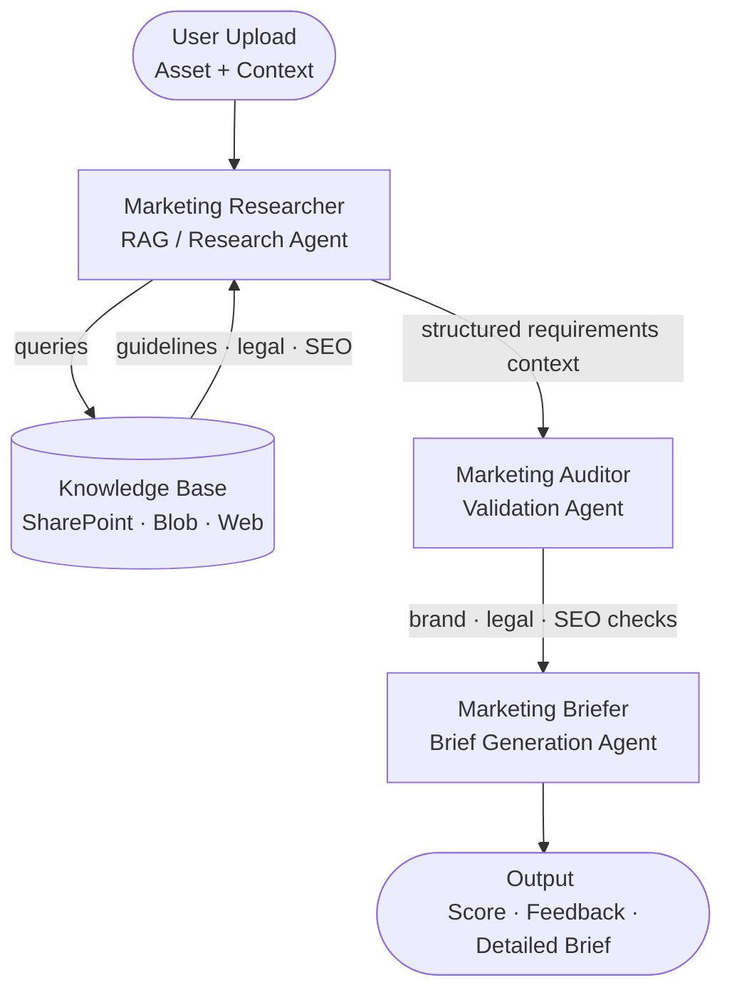

# BrandSense — Project Plan

> **Type:** Project planning document — not a README. Used to drive design decisions and guide development.
> **Status:** Planning — March 2026
> **Goal:** Finalise project name, agent names, agent interactions, and high-level architecture before a line of code is written.

---

## Project Name

**Decided: `BrandSense`**
- Short, memorable, customer-friendly
- Implies intelligent brand awareness rather than just rule-checking
- Neutral enough to apply to brand, legal, and SEO dimensions
- Works as a PoC name and could scale to a product name

---

## Project Overview

Marketing and branding teams deal with high volumes of assets — PDFs, emails, images, and campaign materials — that must conform to brand standards, legal requirements, and SEO best practices. This project provides an agentic pipeline that ingests those assets, validates them against requirements, and produces actionable feedback and a detailed creative brief.

**Core value proposition:**
- Reduce manual brand review time
- Catch legal and compliance issues before publication
- Produce structured creative briefs automatically

---

## Agent Names

Three agents form the pipeline. Names below are working names — final names should be consistent, memorable, and reflect function.

| # | Agent Name | Role | Alternative Names to Consider |
|---|---|---|---|
| 1 | **Marketing Researcher** | Retrieves brand guidelines, legal rules, SEO best practices from knowledge sources | Marketing Scout, Marketing Beacon, Marketing Librarian |
| 2 | **Marketing Auditor** | Validates uploaded assets against retrieved requirements | Marketing Validator, Marketing Guardian, Marketing Sentinel |
| 3 | **Marketing Briefer** | Synthesizes results into a score, narrative feedback, and a creative brief | Marketing Scribe, Marketing Composer, Marketing Summarizer |

> **Decision needed:** Lock in agent names. They will appear in logs, the UI, and API responses. The `Marketing` prefix should be confirmed as the intended convention for all agents in this project.

---

## Agent Interaction

**Decided: Sequential pipeline.** Each agent completes its work and passes a typed output payload to the next agent in the chain. This is the correct model because each step is strictly dependent on the previous one — Marketing Auditor cannot validate without Marketing Researcher's requirements, and Marketing Briefer cannot produce a brief without Marketing Auditor's results. There is no meaningful work any agent can do in parallel with its predecessor.

```
User Input (asset + context)
    │
    ▼
Marketing Researcher
  Queries knowledge base for brand guidelines, legal rules, SEO standards
  Returns structured requirements context
    │
    ▼
Marketing Auditor
  Receives asset + Marketing Researcher output
  Validates asset against each requirement dimension
  Returns per-check results with pass/fail and issue detail
    │
    ▼
Marketing Briefer
  Receives Marketing Auditor output
  Produces score, narrative feedback, and detailed brief
    │
    ▼
Output to User
```

### Large Document Handling

**This is a required design decision for v1.** The sequential pipeline works well for typical assets, but hundreds-of-pages PDFs introduce two hard limits:

| Constraint | Limit | Impact |
|---|---|---|
| Azure AI Document Intelligence | 2,000 pages max | Fine — not a blocker |
| GPT-4.1 context window | ~1M tokens | Large documents are handled comfortably; chunking still recommended for cost control |
| Azure AI Agent Service message size | Varies | Large payloads between agents need to be handled carefully |

**Decided approach: chunk-and-aggregate in the Auditor.**

| Microsoft Foundry Agent Service message size | Varies | Large payloads between agents need to be handled carefully |

```
Auditor receives: asset (via Document Intelligence) + Scout requirements
    │
    ▼
  Split document into chunks (e.g. 20–30 pages each)
    │
    ▼
  For each chunk:
    Run brand · legal · SEO validation against requirements
    Collect per-chunk results
    │
    ▼
  Aggregate: deduplicate issues, consolidate pass/fail per dimension
    │
    ▼
  Emit: single Auditor output payload → Briefer
```

**Implications for development:**
- Auditor needs a chunking loop, not a single LLM call
- Chunk size must be tuned (too small = many calls + cost; too large = context overflow)
- Aggregation logic must handle the same issue appearing in multiple chunks
- Processing time for a 200-page PDF will be longer — set customer expectations in the PoC
- Consider adding a progress indicator or streaming output for the PoC demo

> **Decision needed:** Confirm chunk size strategy (page-count based vs. token-count based). Token-count based is more reliable but requires tokeniser integration.

---

### Agent Communication Contract
Each agent receives and emits a typed message payload. Working schema:
```
Marketing Researcher output → { brand_guidelines, legal_requirements, seo_rules, source_citations[] }
Marketing Auditor output → { brand_checks[], legal_checks[], seo_checks[], overall_pass: bool }
Marketing Briefer output → { score: int, feedback: str, brief: { scope, brand_issues[], legal_issues[], seo_issues[], actions[] } }
```

---

## High-Level Architecture



### Architecture Decisions to Resolve

| Decision | Options | Preference |
|---|---|
|---|
| Orchestration model | Azure AI Foundry Workflow vs. custom TypeScript orchestrator | Foundry Workflow (managed) |
| Agent runtime | Azure AI Agent Service (hosted) vs. local | Azure AI Agent Service |
| Primary language | TypeScript vs. Python | **Python** — all agents, API, and orchestration code |
| Font/color tool language | N/A | **Python** — PyMuPDF exposed as `POST /tools/extract-fonts` on the FastAPI server; surfaced to Foundry via APIM MCP Server |
| Knowledge store | Azure AI Search vs. in-memory context | Azure AI Search (persistent RAG) |
| Asset ingestion | Azure AI Document Intelligence vs. direct file parse | **Hybrid:** Document Intelligence (text) + PyMuPDF (font/color metadata) + GPT-4.1 Vision (visual brand elements) |
| Output delivery | REST API response vs. email/SharePoint write-back | REST API first, write-back later |
| Auth model | Managed Identity vs. API keys | Managed Identity |
| Frontend | None (API only) vs. simple web UI | **React.js (Vite SPA)** — MUI v5 + Emotion, for PoC testing and customer demos |

| | |
|---|---|
| **Inputs** | User-uploaded assets, query context |
| **Sources** | SharePoint, internal wikis, brand portals, web search |
| **Outputs** | Structured requirements and reference context passed to Marketing Auditor |
| **Tools** | Azure AI Search, SharePoint tool, Bing grounding |

---

### 2. Marketing Auditor — Validation Agent

Validates uploaded assets against retrieved requirements across three dimensions.

| | |
**Checks performed:**
- **Brand:** Font, color palette, logo usage, imagery style
#### Document Ingestion — Design Concern

**Azure AI Document Intelligence does not preserve font or color information.** It extracts text, layout, tables, and key-value pairs — but the font family, font color, and design-element colors that are critical for brand checks are embedded in the PDF's internal structure and are discarded during text extraction. Relying on Document Intelligence alone means brand font and color checks would silently produce no data.

**Decided: Hybrid ingestion in the Auditor.**

#### Can GPT-4.1 Vision replace PyMuPDF for font and color analysis?

**Partially — but not for exact brand compliance checking.**

GPT-4.1 Vision analyzes rendered page images and can approximate visual properties, but it cannot extract the exact font or color values stored inside the PDF:

| Check | GPT-4.1 Vision | PyMuPDF |
|---|---|---|
| Font family | Approximates visually ("looks like Segoe UI") | Exact string from PDF internals (e.g. `SegoUIRegular`) |
| Font size | Approximates ("appears small, ~10–12pt") | Exact point size per text span |
| Text color | Approximates ("dark navy blue") | Exact RGB/hex value (e.g. `#0038A8`) |
| Logo placement | ✅ Accurate — purely visual | ✗ Not applicable |
| Image style / layout | ✅ Accurate — purely visual | ✗ Not applicable |

**The implication:** If brand guidelines specify exact values — "must use Segoe UI, #0038A8, minimum 10pt" — Vision-only checking will produce unreliable pass/fail results. The tool could miss violations or flag false positives, which undermines the PoC's value proposition for customers.

**Decision options:**

| Option | PyMuPDF needed? | Font/color accuracy | PoC risk |
|---|---|---|---|
| **A — Vision only** | No | Approximate only | Medium — may miss violations customers care about |
| **B — PyMuPDF custom tool** | Yes (lightweight endpoint) | Exact, deterministic | Low — reliable brand compliance checks |
| **C — Vision for PoC, PyMuPDF for production** | No for now | Approximate for PoC | Acceptable if PoC is clearly scoped as illustrative |

> **Decision needed:** Confirm how strict brand checks must be for the customer PoC.
> - If demonstrating the *concept* with approximate checks is sufficient → Option A (Vision only, simpler, faster to build)
> - If customers need to trust the results as accurate → Option B (PyMuPDF custom tool, exact values)
> - Recommendation: **Option B** — approximate font/color checking is the weakest part of the value proposition; getting it wrong in front of customers undermines the demo.

**Assumed decision: Option B (PyMuPDF) until confirmed otherwise.**

| What to check | Tool | Why |
|---|---|---|
| Text content, structure, tables, disclaimers | Azure AI Document Intelligence | Best-in-class for text extraction and layout |
| Font family, font size, font color, text positioning | `PyMuPDF` (`fitz`) via custom function tool | Exact values from PDF internals — Vision cannot reliably match brand specs |
| Logo placement, imagery style, color palette of design elements | GPT-4.1 Vision (page rendered as image) | Inherently visual — no exact-value alternative exists |
| Metadata (title, author, keywords) | `PyMuPDF` or `pypdf` | Direct PDF metadata access |

#### PyMuPDF and Foundry Workflow Compatibility

**PyMuPDF does not require switching to Microsoft Agent Framework. The project stays in Foundry Workflows.**

Since agents run **inside Microsoft Foundry**, they call tools via the **MCP protocol**. Rather than manually registering individual HTTP endpoints as custom function tools, the FastAPI server is exposed as an **MCP Server through APIM** (APIM → APIs → MCP Servers → Create → Expose an API as an MCP server). Foundry's Marketing Auditor agent connects to the APIM MCP endpoint and discovers all tools automatically via the OpenAPI spec.

- The FastAPI server exposes `POST /tools/extract-fonts` (and `POST /validate`, `GET /health`) with a full OpenAPI spec
- APIM imports the FastAPI OpenAPI spec and creates an MCP Server from it
- The Marketing Auditor agent in Foundry is configured to connect to the APIM MCP endpoint URL
- Foundry discovers `extract_font_color_metadata` and all other tools automatically — no per-tool manual registration
- No ngrok needed for local dev — APIM always routes to the deployed Container App URL (use a dev Container App environment)

| Approach | Stays in Foundry? | Notes |
|---|---|---|
| Code Interpreter only | Yes | PyMuPDF unavailable inside the sandboxed Code Interpreter |
| Custom function tool (manual URL) | Yes | Requires per-tool registration + ngrok for local dev |
| **APIM MCP Server (current approach)** | **Yes** | Automatic tool discovery via OpenAPI; no ngrok; centralised gateway |

> **Decision confirmed:** FastAPI is exposed as an MCP Server via APIM. The Marketing Auditor agent in Foundry connects to the APIM MCP endpoint. No separate Container App, no manual tool registration, no ngrok.

**Implementation note for Auditor:**
- Document Intelligence call: extract text body, tables, detected language
- MCP tool call via APIM (`extract_font_color_metadata`): Foundry calls the tool through the APIM MCP endpoint; FastAPI runs PyMuPDF and returns exact font/color data; agent flags non-compliant values against Marketing Researcher's brand guidelines
- Vision call: render each page (or sampled pages) as an image, prompt GPT-4.1 Vision to evaluate logo placement, image style, and layout compliance
- All three outputs are merged before aggregation and hand-off to Briefer

> **Implication for milestone plan:** M3 (Marketing Auditor) is more complex than a single LLM call — it requires three ingestion paths. Budget extra time.

#### Considered and Rejected: Separate Logo / Visual Inspection Agent

**Decision: No separate agent needed.** Logo placement, imagery style, and color palette inspection are tools *within* the Marketing Auditor, not a distinct pipeline stage. An agent is warranted when it has unique inputs, outputs, and responsibilities that another agent cannot own. Visual brand checking does not meet that bar:

- Its input is the same asset the Auditor already receives
- Its output (logo pass/fail, color issues) feeds directly into `brand_checks[]` in the Auditor's existing output schema
- It is implemented as a GPT-4.1 Vision call — one of the Auditor's three ingestion paths, alongside Document Intelligence and PyMuPDF
- Adding a fourth agent would increase orchestration complexity with no architectural benefit for the PoC

**If this should be revisited:** If visual inspection grows into pixel-level logo zone detection or requires a dedicated computer vision model (e.g. custom Azure AI Vision model fine-tuned on logo placement grids), it could then justify its own agent. Not needed for v1.

---

### 3. Marketing Briefer — Brief Generation Agent

Synthesizes validation results into a structured creative brief and a summary score.

| | |
|---|---|
| **Inputs** | Validation results from Marketing Auditor |
| **Outputs** | Score (0–10), feedback narrative, and detailed brief document |
| **Tools** | Code interpreter (scoring logic), file output |

**Output breakdown:**
- **Score:** 0–10 overall compliance rating
- **Feedback:** Human-readable explanation of issues and recommendations
- **Detailed Brief:** Document outlining scope, brand, creative, and legal needs for revision or campaign approval

---

## Open Questions

- [ ] What is the primary asset type for v1? (PDF only, or also images and email HTML?)
- [ ] Where do brand guidelines live today? (SharePoint site URL, which library?)
- [ ] Is there a legal review team who will validate the legal check logic?
- [ ] What does "done" look like for v1? (API only, or a demo UI?)
- [ ] Do agents need memory across sessions, or is each run stateless?
- [ ] Should the brief be written back to SharePoint, or only returned in the API response?
- [ ] How will the system be evaluated? (Human review, golden dataset, automated scoring metrics?)

---

## Milestone Plan (Draft)

| Milestone | Goal | Target |
|---|---|---|
| M0 — Planning | Finalize names, architecture, data contracts | Week 1 |
| M1 — Scaffold | Repo structure, Python project setup, Terraform infra skeleton, Foundry project, GitHub Actions pipeline skeleton, basic agent stubs | Week 2 |
| M2 — Marketing Researcher | RAG agent functional with AI Search + SharePoint | Week 3–4 |
| M3 — Marketing Auditor | Validation logic against brand + legal + SEO (3 ingestion paths) | Week 5–7 |
| M4 — Marketing Briefer | Brief generation and scoring | Week 8 |
| M5 — Integration | End-to-end pipeline, error handling, logging | Week 9 |
| M6 — Demo | Sample asset demo, output review, feedback | Week 10 |

---

## Tech Stack & Azure Services

| Component | Technology |
|---|---|
| Primary language | **Python** — all agents, orchestration code, and API |
| Font/color tool language | **Python** — PyMuPDF exposed as `POST /tools/extract-fonts` on the FastAPI server; surfaced to Foundry via APIM MCP Server |
| Agent framework | Microsoft Foundry (Azure AI Agent Service) — agents deployed to and executed in Foundry |
| Hosting — agents | **Microsoft Foundry Agent Service** — agent definitions deployed to Foundry, execution managed by Foundry |
| Language model | Azure OpenAI (GPT-4.1) |
| Vision model | Azure OpenAI (GPT-4.1 with Vision) — brand visual checks |
| Document text extraction | Azure AI Document Intelligence |
| Font / color metadata extraction | PyMuPDF (`fitz`) — `POST /tools/extract-fonts` on FastAPI; discovered by Foundry via APIM MCP Server |
| Knowledge retrieval | Azure AI Search (RAG) |
| Knowledge sources | SharePoint Online, Azure Blob Storage |
| Orchestration | Azure AI Foundry Workflows |
| Infrastructure as Code | **Terraform** |
| Hosting — API + tools | Azure Container Apps (FastAPI: `POST /validate` + `POST /tools/extract-fonts` + React UI static files) |
| API Gateway + MCP Server | Azure API Management — imports FastAPI OpenAPI spec; exposes as MCP Server for Foundry tool discovery |
| Frontend | React.js (Vite, SPA) |
| UI component library | MUI v5 (`@mui/material`, `@mui/icons-material`) |
| Styling | Emotion (`@emotion/react`, `@emotion/styled`) |

---

## Expected Input / Output

### Input

```
File:    campaign_email_draft.pdf
Context: Q2 product launch campaign for Azure AI services
```

### Output

```json
{
  "score": 7,
  "feedback": "Font usage is compliant. Logo placement violates brand guidelines (section 3.2). Missing legal disclaimer required for regulated markets. SEO title tag exceeds recommended character limit.",
  "brief": {
    "scope": "Q2 product launch  Azure AI services campaign",
    "brand_issues": ["Logo placement", "Image aspect ratio"],
    "legal_issues": ["Missing regional disclaimer"],
    "seo_issues": ["Title tag too long", "Missing alt text on 3 images"],
    "recommended_actions": [
      "Reposition logo to approved zones",
      "Add disclaimer block",
      "Shorten title tag to <60 chars",
      "Add alt text to all images"
    ]
  }
}
```

---

## CI/CD Automation for Agent Deployment

Automating agent deployment is critical for reliability, repeatability, and rapid iteration. This project will use **GitHub Actions** for CI/CD and **Terraform** for infrastructure provisioning:

- Lint and test all Python agent code on every pull request and main branch push
- Build and test the Vite React UI on every PR
- Package and publish container images to Azure Container Registry
- Provision and update all Azure infrastructure via Terraform (`terraform plan` / `terraform apply`)
- Deploy containers to Azure Container Apps
- Deploy agent definitions and workflows to Foundry
   - Register or update the APIM MCP Server when FastAPI OpenAPI spec changes
   - Connect Foundry Auditor agent to APIM MCP endpoint
- Run post-deployment validation (smoke tests) to ensure agents are live and callable

**Key pipeline stages:**
1. **Build & Test**
   - Python: `pip install -r requirements.txt` → `ruff check` → `pytest`
   - UI: `npm ci` → `npm run build` (Vite)
   - Build Docker image for the Python API
2. **Publish:** Push images to Azure Container Registry
3. **Provision:** `terraform plan` (PR) / `terraform apply` (main) for all Azure resources
4. **Deploy:**
   - Deploy containers to Azure Container Apps (FastAPI server + React UI)
   - Configure APIM MCP Server pointing to the Container App URL
   - Deploy agent definitions and Foundry Workflow
5. **Validate:** Run basic API/agent health checks

**Terraform scope** (resources managed):
- Azure Container Apps environment and app (FastAPI server + React UI static files)
- Azure API Management (MCP Server exposing FastAPI OpenAPI spec to Foundry)
- Microsoft Foundry project and connections
- Azure AI Search index
- Azure Container Registry
- Azure Blob Storage
- Managed Identity and role assignments

**GitHub Actions secrets required:** Only 3 — set automatically by running `scripts/New-GitHubOidc.ps1` once:
- `AZURE_CLIENT_ID` — Entra app registration client ID (OIDC)
- `AZURE_TENANT_ID` — Azure tenant ID
- `AZURE_SUBSCRIPTION_ID` — Azure subscription ID

All other values (ACR login server, Terraform state storage, resource group, AI project
endpoint, Key Vault name, health check URL) are either hardcoded naming conventions in
`deploy.yml` or derived from `terraform output` within the workflow — no manual secret
entry needed.

```powershell
# One-time setup (requires az login + gh auth login):
.\scripts\New-GitHubOidc.ps1
```

> **Action:** Add `.github/workflows/` and `infra/` (Terraform) directories as part of the M1 scaffold. Define all secrets in the repository before M2 development begins.